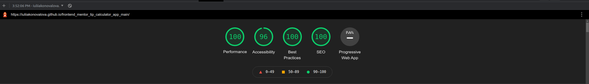

# Frontend Mentor - Tip calculator app


The project was based on the challenge provided by [Frontend Mentor](https://www.frontendmentor.io).


This is a solution to the [Time tracking dashboard challenge on Frontend Mentor](https://iuliiakonovalova.github.io/frontend_mentor_tip_calculator_app_main/). 

## The design provided


## Table of contents

- [User Stories](#user-stories)
- [Features](#features)
- [Technologies Used](#technologies-used)
- [Design](#design)
- [Bugs](#bugs)
- [Testing](#testing)
  - [Compatibility](#compatibility)
  - [Validator testing](#validator-testing)
  - [Lighthouse Report](#lighthouse-report)
- [Deployment](#deployment)
- [Author](#author)
- [Credits](#credits)
- [Acknowledgments](#acknowledgments)


I was using design files provided for this challenge in order to make the result look as similar as possible to the provided images.

I have also added various breakpoints in order to provide the best user experience.

The solution to this challenge can be accessed by this [link](https://iuliiakonovalova.github.io/frontend_mentor_tip_calculator_app_main/)


---
## User Stories

### First Time Visitor Goals:

* As a First Time Visitor, I want to easily understand the main purpose of the app, so I can learn more about this app.
* As a First Time Visitor, I want to be able to easily navigate through the app, so I can find the content.
* As a First Time Visitor, I want to find the app useful.

### Frequent Visitor Goals:
* As a Frequent User, I want to be able always access the app, so I can count the tips every now and then.
* As a Frequent User, I want to have different options for input, so I can get the required numbers of payment.


---

## Features

+ ### Main Page

    - Represent: 

        * the payments calculator.
        

    - Consist:

        

        * Logo of the app.

        

        * Has the payment calculator.

    #### Input Part
    ---

    

    * Has input bill, 5 tip buttons and 1 custom tip input, and number of people input.

    * App takes only numbers as on inputs.

    * When the user picks a tip button it becomes visible to the user by changing the colors; and if the user picks another tip button, it returns the previous button to initial state and changes the colors of a new tip button.

    

    * If the user decides to user Custom input after clicking tip buttons, all tip buttons will return to initial state as well.

    

    * When the user types the bill amount and picks needed amount of tip, a warning message will appear to remind th user to type the number of people included in the bill.

    

    * This message will also appear when the user types "0" in Number of People input.

    

    #### Output Part
    ---

    

    * This block presents results of the calculations if all fields are filled out.

    * It shows Tip Amount for an individual and Total Sum for an individual according to the number of people paying for the bill.

    * It has a reset button, which which is active when the calculations have been done. It resets all inputs.

    

---

## Technologies Used

- [HTML](https://developer.mozilla.org/en-US/docs/Web/HTML) - was used as the foundation of the site.
- [CSS](https://developer.mozilla.org/en-US/docs/Web/css) - was used to add the styles and layout of the site.
- [CSS Flexbox](https://developer.mozilla.org/en-US/docs/Learn/CSS/CSS_layout/Flexbox) - was used to arrange items symmetrically on the pages.
- [CSS Grid](https://developer.mozilla.org/en-US/docs/Web/CSS/grid) - was used to make "gallery" and "contact" pages responsive.
- [CSS roots](https://developer.mozilla.org/en-US/docs/Web/CSS/:root) - was used to declaring global CSS variables and apply them throughout the project. 
- [JS](https://www.javascript.com/) - was used to make calculations and display content on the page.
- [JavaScript HTML DOM](https://www.w3schools.com/js/js_htmldom.asp) - was used to access and manipulate elements in html file.
- [VSCode](https://code.visualstudio.com/) - was used as the main tool to write and edit code.
- [Git](https://git-scm.com/) - was used for the version control of the website.
- [GitHub](https://github.com/) - was used to host the code of the website.
- [GIMP](https://www.gimp.org/) - was used to make and resize images for the README file.

---
## Design

- The color scheme and font-family were provided by [Frontend Mentor](https://www.frontendmentor.io).

- Background Color:


- Cards Background Color:


- Input Background Color:


- Accent Color 1:


- Accent Color 2:


- Warning Message Color:


- Font-family (Space Mono):


---

## Bugs
+ **Solved bugs**

1. The colors of the tip buttons did not change to initial state after choosing Custom Input

    - *Solutions:* Add code to ```getCustomTipValue()```.
    
    ```javascript
    let getCustomTipValue = () => {
      tipPercentage = Number(customInput.value) / 100 + 1;
      tipButtons.forEach((item, i) => {
        item.style.backgroundColor = '#00494d';
        item.style.color = '#ffffff';
      });

      totalAmount();
    };
    ```
1. The app was counting results right after the input
    - *Solutions:* Add if-else statement to main function which calculates the results.
    
    ```javascript
    let totalAmount = () => {
      //Reminds user to set number of people
      if (billAmountVariable !== 0 && tipPercentage !== 0 && numberOfPeople === 0) {
        warning.classList.remove('alert__info--hidden');
        document.querySelector('.input--hidden').style.border = '3px solid #dc8f78';
      } else if (billAmountVariable !== 0 && tipPercentage !== 0 && numberOfPeople !== 0) {
        //Deletes warning message
        warning.classList.add('alert__info--hidden');
        document.querySelector('.input--hidden').style.border = '3px solid #a0e7df';
        // Counts the amounts

        let total = (billAmountVariable * tipPercentage) / numberOfPeople;
        let totalTip = ((billAmountVariable * tipPercentage) - billAmountVariable) / numberOfPeople;
        // Present the amounts
        finalTipToPay.innerHTML = `$${totalTip.toFixed(2)}`;
        finalAmountToPay.innerHTML = `$${total.toFixed(2)}`;
        // Activates the reset btn
        resetButton.addEventListener('click', resetAll);
        resetButton.style.backgroundColor = '#26c0ab';
      }
    };
    ```


+ **Unsolved bugs**

    - None.

---

## Testing
### Compatibility:

+ The app was tested on the following browsers: Chrome, Firefox, Brave, Edge:

  - Chrome:

  
  
  - Firefox:

  

  - Brave:

  


+ The app was checked by devtools implemented on Firefox and Chrome browsers.

+ The app was checked with [Responsive Website Design Tester](https://responsivedesignchecker.com/).

  1. Mobile Screens:

    - Mobile 320x480, 320x568, 360x640, 375x667, 384x640, 411x731, 414x736:

     

      
  1. Tablets Screens:

    - Tablet 600x960, 768x1024, 800x1280, 1366x1024, 1600x900, 1680x1050, 1920x1080, 1920x1200:
        
    
      
  1. Desktop Screens:

    - Desktop 1024x600, 1024x800, 1366x768, 1440x900:
        
    

+ The functionality of the links in the app was checked as well by different users.

---
### Validator testing
+ #### HTML
  
  - No errors or warnings were found when passing through the official [W3C](https://validator.w3.org/) validator.
  
    - Main Page:
  
    
+ #### CSS
  
  - No errors or warnings were found when passing through the official [W3C (Jigsaw)](https://jigsaw.w3.org/css-validator/#validate_by_uri) validator except the 3 warnings: 

  

  
+ #### JS
  
  - No errors or warnings were found when passing through the official [JSHint](https://jshint.com/) validator except the warnings that pointing at the use of webkits 

  


---

### Lighthouse Report



- Issues:

The following issues regarding Accessability were reported due to the designer decisions regarding colors 


---

## Deployment

- The site was deployed to GitHub pages. The steps to deploy are as follows: 
  - In the [GitHub repository](https://github.com/IuliiaKonovalova/frontend_mentor_tip_calculator_app_main/), navigate to the Settings tab 
  - From the source section drop-down menu, select the **Main** Branch, then click "Save".
  - The page will be automatically refreshed with a detailed ribbon display to indicate the successful deployment.

The live link can be found [here](https://iuliiakonovalova.github.io/frontend_mentor_tip_calculator_app_main/)

---
### Local Deployment

In order to make a local copy of this project, you can clone it.
In your IDE Terminal, type the following command to clone my repository:

- `git clone https://github.com/IuliiaKonovalova/frontend_mentor_tip_calculator_app_main.git`

---
## Author

- Website - [Iuliia Konovalova](https://github.com/IuliiaKonovalova)
- Frontend Mentor - [@IuliiaKonovalova](https://www.frontendmentor.io/profile/IuliiaKonovalova)

---

## Credits

+ ### Content and Design

  - [Frontend Mentor](https://www.frontendmentor.io) had provided all necessary content and design that was used in order to complete this challenge.

+ ### Font

  - [Google Fonts](https://fonts.google.com/) was usd in order to implement required font.

## Acknowledgement

  - [Frontend Mentor](https://www.frontendmentor.io) for inspiring to improve my skills.
  
---


---
